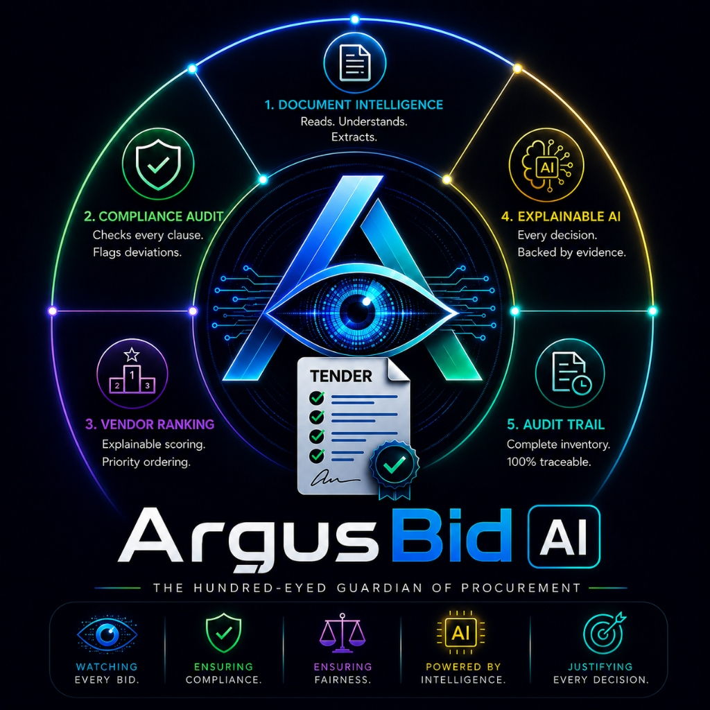

<div align="center">

#  Argus Bid AI — Tender Audit & Compliance

**A production-grade, deterministic AI-driven tender auditing and compliance platform for PSUs.**


[Report Bug](https://github.com/alokitadutta22/Argus-Bid-AI-Tender-Audit-Compliance/issues) · [Request Feature](https://github.com/alokitadutta22/Argus-Bid-AI-Tender-Audit-Compliance/issues)

</div>

---

**Argus Bid AI** is a highly auditable and visually spectacular AI-driven Tender Auditing & Compliance Platform. Built specifically for Public Sector Undertakings (PSUs) like IOCL, it automates the tedious, manual process of validating vendor submissions against complex Master BID/NIT (Notice Inviting Tender) documents. It ensures rapid, bias-free evaluations while maintaining strict legal defensibility through deterministic rule-engines.

---

## 🏢 Academic & Industrial Context

<div align="center">
  
</div>

> [!NOTE]
> This platform was engineered as part of a **Software Engineering (SWE) Summer Internship** at **Indian Oil Corporation Limited (IOCL), Haldia Refinery** during my first year, second semester (June 15th, 2026 – July 13th, 2026).
>
> 🏢 **Guidance & Compliance:** The architectural design, project structure, and enterprise compliance standards were developed under the expert guidance and explicit instructions of my supervisors in the **Information Systems (IS) Department** at IOCL, Haldia Refinery. Their mentorship was instrumental in ensuring the tool meets the rigorous demands of public sector procurement.

---

## 🎯 Executive Overview

### 🚨 The Problem

Procurement evaluation is traditionally a manual bottleneck. Officers must manually cross-reference hundreds of pages of vendor submissions against strict Pre-Qualification Criteria (PQC), Mandatory Documents (MAFs, EMDs), and Technical Specifications. This process is slow, prone to human error, and lacks instant auditability. Black-box AI tools cannot be used because they hallucinate and lack the strict deterministic traceability required for public procurement.

### 💡 The Solution

Argus Bid AI transforms procurement from a manual chore into an instant, deterministic, and auditable process. By acting as a strict compliance gate, it extracts the matrix of requirements from the Master BID and cross-matches it against every vendor's submission.

### ✨ Tech Innovations

- **Deterministic Rule Engine:** Unlike generative AI that can hallucinate, Argus Bid AI relies on strict logic to evaluate pass/fail compliance.
- **Explainable Audit Trails (XAI):** Every single decision, rank, or disqualification is backed by a legally defensible, traceable text snippet.
- **100% Local Processing:** The entire platform runs completely on your local machine with zero external API calls or internet connection dependencies, ensuring absolute security.
- **Dynamic Multi-modal OCR:** Extracts text and tables locally and effortlessly.

### 🧩 Core Product Modules

- **Compliance Engine:** Evaluates PQC, MAFs, and Mandatory Documents based on extracted constraints.
- **Comparative Matrix:** Automatically generates side-by-side technical comparison tables for all responsive bidders.
- **Interactive Dashboard:** A premium, glassmorphic UI for uploading documents, running audits, and viewing explainable results.
- **Exportable Reports:** Instantly export the entire dashboard analysis as a physical or PDF report for stakeholder review.

### 🛡️ 100% Local & Secure Design

The entire Argus platform is built to be **100% local, deterministic, and rule-based**. When evaluating critical compliance rules (like checking experience certificates, revenue numbers, dates, or missing mandatory documents), it uses strict programmatic logic. This prevents "AI hallucinations" and ensures that every evaluation result is legally auditable, mathematically absolute, and completely secure.

---

## 🚀 What Is Implemented Today

- Full document parsing using `pdfplumber` and `pypdf`.
- Deterministic extraction of Pre-Qualification Criteria and Mandatory Documents.
- Explainable AI (XAI) rationale generation for all vendor rankings and disqualifications.
- Beautiful, highly responsive, and dynamic UI built with Streamlit and custom CSS/JS injections.
- Seamless one-click deployment using Render Blueprints.

---

## 🛠️ Tech Stack

| Category                | Technology         | Details                                                                 |
| :---------------------- | :----------------- | :---------------------------------------------------------------------- |
| **Frontend & UI**       | Streamlit          | High-performance, pure-Python UI framework.                             |
|                         | Custom CSS/JS      | Premium glassmorphic styling, animations, and dynamic DOM manipulation. |
| **Backend Logic**       | Python 3.11        | Core logic, data processing, and document handling.                     |
| **Document Processing** | pdfplumber & pypdf | Robust text extraction from complex PDFs.                               |
| **Deployment**          | Render             | Native Python Web Service for secure, iframe-free hosting.              |

---

## 🏗️ Architecture & Decoupled Design

Argus Bid AI is designed with a modular, decoupled architecture to separate logic from presentation, making it scalable, maintainable, and independently testable:

1. **Presentation Layer (`ui_styles.py` & `tender_audit_platform.py`):**
   - **`ui_styles.py`**: A dedicated styling module providing custom CSS injections, CSS animations, and premium glassmorphic UI components (custom HTML cards, KPI tiles, progress bars, and document status cards).
   - **`tender_audit_platform.py`**: Streamlined Streamlit frontend that orchestrates the overall application layout, file upload handlers, session state routing, and interactive page views.
2. **Evaluation & Processing Layer (`audit_engine.py`):**
   - **`audit_engine.py`**: A pure, zero-UI dependency backend containing the rules dictionary, mock databases, rule extraction parser logic, and vendor audit evaluation functions. Because it is completely decoupled from Streamlit, it can run as an independent background script or be integrated into command-line tooling.

---

## 📂 Repository Structure

```
Argus-Bid-AI-Tender-Audit-Compliance/
├── tender_audit_platform.py    # Main Streamlit UI layout & dashboard routing
├── audit_engine.py             # Pure Python audit logic (Zero UI dependencies)
├── ui_styles.py                # Premium CSS styling, animations, & HTML renderers
├── requirements.txt            # Python dependencies
├── render.yaml                 # Render Blueprint for 1-click deployment
├── run.bat                     # Windows startup script for local dev
├── .gitignore                  # Ignored files and local caches
└── README.md                   # Project documentation
```


---

## 💻 Local Setup

### Prerequisites

- [Python 3.8+](https://www.python.org/)
- [Git](https://git-scm.com/)

### 1. Clone the Repository

```bash
git clone https://github.com/alokitadutta22/Argus-Bid-AI-Tender-Audit-Compliance.git
cd Argus-Bid-AI-Tender-Audit-Compliance
```

### 2. Install Dependencies & Run

**Using the Batch Script (Windows):**
Simply double-click the `run.bat` file. It will silently install dependencies and launch the platform.

**Manual Setup (Mac/Linux/Windows):**

```bash
pip install -r requirements.txt
streamlit run tender_audit_platform.py
```

The application will be accessible at `http://localhost:8501`.

---

## 🔒 Security Notes

- **Data Privacy:** All document parsing and deterministic auditing is done in-memory. Uploaded sensitive tender documents are processed 100% locally and are not persisted or sent to any public server.

---

## ☁️ Deployment (Render)

This project is fully configured for a secure, native deployment on **Render**.

### 1-Click Deploy

1. Create an account at [Render.com](https://render.com).
2. Go to your Dashboard -> **New +** -> **Blueprint**.
3. Connect your GitHub repository.
4. Render will detect the `render.yaml` file and instantly deploy the application as a native Python Web Service.

---

## 🗺️ Roadmap

- [ ] Integration with advanced Document Intelligence for superior scanned-handwriting OCR.
- [ ] Multi-tenant support for different PSU departments.
- [ ] Export to Excel (.xlsx) functionality for the Comparative Matrix.

---

**Alokita Dutta**

Current Maintainer
LinkedIn: [https://www.linkedin.com/in/alokitadutta](https://www.linkedin.com/in/alokitadutta)  
GitHub: [@alokitadutta22](https://github.com/alokitadutt22)

Contributors:

**Debdatta Panda**  
Initial development, platform architecture, and implementation
LinkedIn: [https://www.linkedin.com/in/debdatta-panda-dp11](https://www.linkedin.com/in/debdatta-panda-dp11)  
GitHub: [@MyselfDebdatta](https://github.com/MyselfDebdatta)
